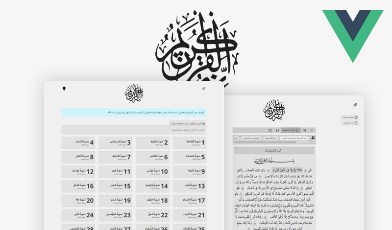

# vuejs quran



الاصدار الجديد من تطبيق الويب القرآن الكريم
[مشاهدة التطبيق](https://vuejs-quran.web.app/)

## تعديل مسار التطبيق
```html
<meta name="url" content="/example/">
```

## Project setup
```
npm install
```

### Compiles and hot-reloads for development
```
npm run serve
```

### Compiles and minifies for production
```
npm run build
```

### Run your unit tests
```
npm run test:unit
```

### Lints and fixes files
```
npm run lint
```

### Customize configuration
See [Configuration Reference](https://cli.vuejs.org/config/).
